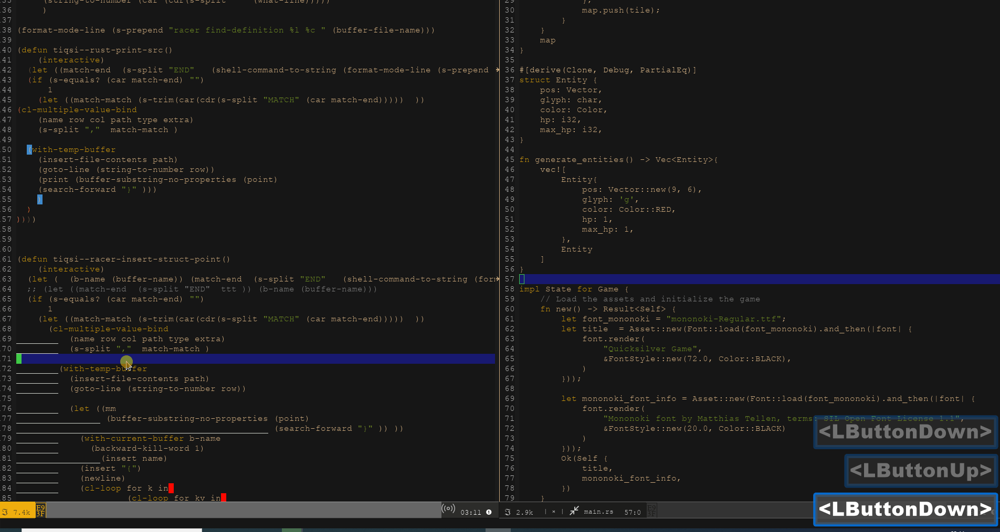

# Tiqsi Emacs <a href="https://github.com/SerialDev/tiqsi-emacs/"></a>


```

    __________________     Fully self contained emacs IDE experience.  
   |__________________|   
      \\ \ \ / / //        Considers usage on windows(WSL) , linux, OSx, and,
      \\_|_|_|_//          cloud remote connection[for repl usage] a first class citizen.
 Tiqsi |        |          
       | o    o | Emacs    
    __________________
   |__________________|
        \______/         
      
```

### BNFC
```
BNFC Grammar writting & syntax highlighting
```

### ASSEMBLY
```
  Mips and Arm ASM support
```

### C
```
With continuosly incremental support for:  
    -- Meson  
    -- Cmake --- [WIP] full parser  
```

### Rust
```
Rust Repl support through  
Extra racer tools
```


### Python
```
AWS support and automatic remote repl execution
```
### Java
```
[WIP]
```

### scala
```
[WIP]
```

### Clojure
```
CLJS Support  
Lein Hydras
```

### Lisp 
```
Elisp, Common Lisp and, Scheme are widely supported
```

### GO
```
[WIP]
```

### Elm
```
WIP
```

### Nim
```
Added repl support
```

### Typescript
```
[WIP]
```
### C# 
```
C# & F# Supported
```

Heavy use of hydras 


` ` _ _ _ _ _ _ _ _ _` ` ` ` |    
`  |_ _ _ _ _ _ _ _ _ |` ` ` |    
` ` ` \\\\ \\ \\ // ///` ` ` ` ` |
` ` `  \\\\_|_|_| // ` ` ` ` ` |  
 Tiqsi |        |` ` ` ` ` ` |    
` ` `  | o    o | Emacs` ` ` |    
` ` _ _ _ _ _ _ _ _ _  ` ` ` |    
`  |_ _ _ _ _ _ _ _ _ |` ` ` |    
` ` ` ` \\_ _ _ /` ` ` ` ` ` `|   


