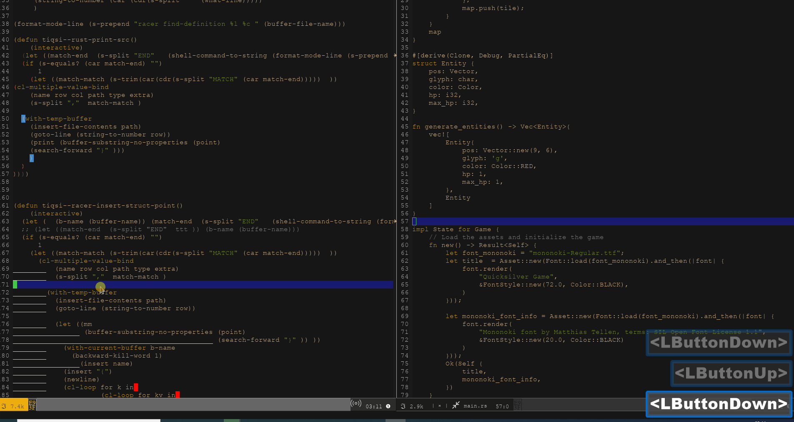

# Tiqsi Emacs Configuration Framework <a href="https://github.com/SerialDev/tiqsi-emacs/"> </a> 

A comprehensive, high-performance, self-contained Emacs configuration framework designed for cross-platform development (Windows/WSL, Linux, macOS). Provides a complete IDE experience with extensive language support, remote development capabilities, and optimized performance.

## Quick Start

### Installation

```bash
# Clone the repository
git clone https://github.com/SerialDev/tiqsi-emacs.git ~/tiqsi-emacs

# Launch Tiqsi Emacs (always use init-lite.el for best performance)
XLIB_SKIP_ARGB_VISUALS=1 emacs -q -l ~/tiqsi-emacs/init-lite.el &
```

### Key Features

- **High Performance**: Sub-second Python project navigation, optimized LSP integration
- **Full LSP Support**: Complete Language Server Protocol with excellent functionality
- **Modern UI**: Ultra-fast beacon with comet tail, spaceline, all-the-icons
- **Smart Package Management**: Straight.el with intelligent dependency management
- **Remote Development**: AWS REPL execution, TRAMP integration, venv support
- **Smart Completion**: Company-mode with LSP backends and fuzzy matching
- **Powerful Navigation**: Helm/IDO, avy, ace-window, project management

## Complete Keybindings Reference

### Navigation & Movement

#### Window Navigation
| Key | Function | Description |
|-----|----------|-------------|
| `M-w`, `C-x C-w` | sdev/jump-window | Jump between windows |
| `C-t` | Jump to *vterm* | Switch to terminal buffer |
| `C-c jj` | avy-goto-word-or-subword | Jump to word using avy |
| `C-c jw` | ace-window | Ace window selection |
| `C-c js` | ace-swap-window | Swap windows using ace |
| `C-M-<left>` | windmove-left | Move to window on the left |
| `C-M-<right>` | windmove-right | Move to window on the right |
| `C-M-<up>` | windmove-up | Move to window above |
| `C-M-<down>` | windmove-down | Move to window below |

#### Window Management
| Key | Function | Description |
|-----|----------|-------------|
| `C-c .` | compare-windows | Compare entity across windows |
| `C-c g` | toggle-window-split | Toggle window split orientation |
| `C-c l` | buf-move-left | Move buffer left |
| `C-c r` | buf-move-right | Move buffer right |
| `C-c u` | buf-move-up | Move buffer up |
| `C-c d` | buf-move-down | Move buffer down |
| `C-c w` | rotate-windows | Rotate window configuration |

#### Text Navigation
| Key | Function | Description |
|-----|----------|-------------|
| `C-<right>` | forward-word | Forward word |
| `C-<left>` | backward-word | Backward word |
| `C-<up>` | backward-paragraph | Previous blank line |
| `C-<down>` | forward-paragraph | Next blank line |
| `M-<up>` | backward-paragraph | Previous blank line (alt) |
| `M-<down>` | forward-paragraph | Next blank line (alt) |
| `M-<right>` | forward-word | Forward word (alt) |
| `M-<left>` | backward-word | Backward word (alt) |
| `<home>` | move-beginning-of-line | Beginning of line |
| `<end>` | move-end-of-line | End of line |
| `<pgup>` | scroll-down-command | Page up |
| `<pgdown>` | scroll-up-command | Page down |
| `C-a` | smart-line-beginning | Smart move to beginning of line |
| `C-S-a` | move-end-of-line | Move to end of line |
| `%` | match-paren | Match parenthesis |

#### Buffer Navigation
| Key | Function | Description |
|-----|----------|-------------|
| `C-c 3` | switch-to-buffer | Switch to buffer |
| `C-c 2` | next-buffer | Next buffer |
| `C-c 1` | previous-buffer | Previous buffer |
| `C-c >` | end-of-buffer | End of buffer |
| `C-c <` | beginning-of-buffer | Beginning of buffer |

### Editing & Text Manipulation

#### Basic Editing
| Key | Function | Description |
|-----|----------|-------------|
| `M-a` | yank | Yank (paste) |
| `M-z` | kill-region | Kill region (cut) |
| `<backtab>` | unindent | Un-indent by removing 4 spaces |
| `C-S-<right>` | shift-right | Shift text right |
| `C-S-<left>` | shift-left | Shift text left |
| `C-c )` | match-paren | Match parenthesis |
| `C-=` | er/expand-region | Expand region |

#### Code Editing
| Key | Function | Description |
|-----|----------|-------------|
| `C-c C-s` | eval-last-sexp | Eval last sexp (Emacs Lisp) |
| `<tab>` | company-indent-or-complete | Smart indent or complete |

### Search & File Operations

#### Search & Navigation
| Key | Function | Description |
|-----|----------|-------------|
| `M-x` | helm-smex | Execute command (helm-smex) |
| `C-x C-x` | helm-smex | Execute command (alternative) |
| `C-x b` | helm-mini | Buffer switching with helm |
| `C-x f` | ido-find-file | Find file with IDO |
| `M-f` | find-file | Find file |
| `M-F` | find-file-other-window | Find file in other window |
| `M-i` | helm-swoop-back-to-last-point | Helm swoop back to last point |

### Language-Specific Keybindings

#### Python Development (Full LSP Support)
| Key | Function | Description |
|-----|----------|-------------|
| `C-.` | lsp-find-definition | Find definition (LSP/xref) |
| `C->` | lsp-find-definition-side-buffer | Find definition in side buffer |
| `C-` | lsp-ui-peek-find-definitions | LSP UI peek definitions |
| `C-,` | xref-pop-marker-stack | Go back (xref) |
| `C-~` | lsp-ui-peek-find-references | LSP UI peek references |
| `C-c n` | flycheck-next-error | Flycheck next error |
| `C-c b` | flycheck-previous-error | Flycheck previous error |
| `C-c ee` | flycheck-list-errors | Flycheck list errors |
| `C-c C-c` | python-compile-uv | Compile with UV/venv support |
| `C-c C-a` | python-send-line | Send line to REPL |
| `C-c C-s` | python-send-line-print | Send line wrapped in print() |
| `C-c C-r` | python-send-region | Send region to REPL |

**Python Features:**
- AWS support and automatic remote REPL execution
- LSP integration with pyright
- Virtual environment support (venv, UV)
- Remote development capabilities
- Function extraction and docstring analysis
- Black formatter integration

#### Rust Development (Hydra: `C-c C-c`)
| Key | Function | Description |
|-----|----------|-------------|
| `r` | cargo run | Run Rust project |
| `b` | cargo build | Build project |
| `+b` | cargo build --release | Release build |
| `t` | cargo test | Run tests |
| `k` | cargo check | Check project |
| `m` | cargo fmt | Format code |
| `q` | cargo clippy | Run clippy |
| `i` | cargo init | Initialize project |
| `u` | cargo update | Update dependencies |
| `x` | cargo run --example | Run example |
| `n` | cargo new | New project |
| `c` | cargo repeat | Repeat last command |
| `f` | cargo test current | Current test |
| `e` | cargo bench | Benchmark |
| `l` | cargo clean | Clean project |
| `s` | cargo search | Search crates |
| `o` | cargo test file | Current file tests |
| `d` | cargo doc | Generate documentation |

**Rust Features:**
- Full LSP integration with rust-analyzer
- REPL support through evcxr-mode
- Racer integration for code completion
- DAP mode for debugging
- Extensive cargo tooling



#### Clojure Development (Hydra: `M-c`)
| Key | Function | Description |
|-----|----------|-------------|
| `<f1>` | cider-start-repl | Start REPL |
| `<f2>` | cider-connect | Connect to REPL |
| `<f3>` | lein-compile-uberjar | Compile uberjar |
| `C-<up>` | paredit-forward | Move forward a parenthesis |
| `M-<up>` | paredit-wrap | Wrap around a parenthesis |
| `C-<down>` | paredit-backward | Move backward a parenthesis |
| `M-<down>` | paredit-splice | Splice a sexp |
| `M-<right>` | paredit-forward-slurp | Forward slurp parenthesis |
| `C-<right>` | paredit-backward-barf | Backward barf parenthesis |
| `M-<left>` | paredit-forward-barf | Forward barf parenthesis |
| `C-<left>` | paredit-backward-slurp | Backward slurp parenthesis |
| `C-s` | cider-eval-last-sexp | Evaluate last sexp |

**Clojure Features:**
- CLJS support
- Lein hydras for project management
- CIDER integration
- Figwheel support
- Paredit for structural editing

#### C/C++ Development
| Key | Function | Description |
|-----|----------|-------------|
| `M-m` | make-without-asking | Run make without asking |

**C/C++ Features:**
- Meson and CMake support for project management
- Compile and run functions for easy code execution
- AddressSanitizer integration for memory error detection
- strace and clang-tidy integrations
- coz integration for causal profiling
- GDB integration for debugging
- Smartparens support
- Header/implementation file toggling

#### Emacs Lisp Mode
| Key | Function | Description |
|-----|----------|-------------|
| `C-.` | xref-find-definitions | Find definitions |
| `C-,` | xref-pop-marker-stack | Pop marker stack |
| `C-c C-s` | eval-last-sexp | Evaluate last sexp |

### Mode-Specific Keybindings

#### Org Mode
| Key | Function | Description |
|-----|----------|-------------|
| `C-l` | org-store-link | Store link |
| `C-a` | org-agenda | Org agenda |
| `C-x C-e` | cider-eval-last-sexp | Cider eval last sexp |
| `C-c C-d` | cider-doc | Cider documentation |
| `C-c C-i` | org-insert-reveal-image | Insert reveal.js image |

#### Markdown Mode
| Key | Function | Description |
|-----|----------|-------------|
| `C-c gg` | writegood-grade-level | Writegood grade level |
| `C-c ge` | writegood-reading-ease | Writegood reading ease |

#### ERC Mode
| Key | Function | Description |
|-----|----------|-------------|
| `C-c e` | erc-insert-emoticon | Insert emoticon |
| `M-.` | erc-goto-definition | ERC goto definition |

#### Shell/Comint Mode
| Key | Function | Description |
|-----|----------|-------------|
| `C-c C-l` | helm-comint-input-ring | Helm comint input ring |

### Special Functions & Tools

#### Compilation & Building
| Key | Function | Description |
|-----|----------|-------------|
| `M-m` | make-without-asking | Make without asking |

#### Tags Navigation
| Key | Function | Description |
|-----|----------|-------------|
| `M-.` | find-tag | Find tag |
| `M-*` | helm-etags-history | Helm etags history |
| `M-,` | helm-etags-history-back | Helm etags history go back |
| `M-/` | helm-etags-history-forward | Helm etags history go forward |

#### Version Control & Navigation
| Key | Function | Description |
|-----|----------|-------------|
| `<f12>` | lsp-goto-type-definition | LSP goto type definition |
| `<f10>` | xref-go-back | Xref go back |

#### UI Controls
| Key | Function | Description |
|-----|----------|-------------|
| `C-#` | minimap-mode | Toggle minimap mode |
| `M-<f9>` | neotree-toggle | Toggle neotree |

#### Hydras & Special Modes
| Key | Function | Description |
|-----|----------|-------------|
| `C-c h` | helm-hydra | Helm menu hydra |
| `<escape>` | vim-movement-hydra | Vim movement mode hydra |
| `C-,` | parinfer-toggle-mode | Parinfer toggle mode |
| `C-c v` | evil-mode | Toggle evil mode |

#### AI Assistance (Claude Code Integration) - Hydra-based
| Key | Function | Description |
|-----|----------|-------------|
| `M-c` | hydra-claude/body | Open Claude hydra menu (primary) |
| `C-c a` | hydra-claude/body | Open Claude hydra menu (alternative) |
| `<f8>` | hydra-claude/body | Open Claude hydra menu (function key) |
| `C-c C-a` | explain-error | Quick explain error (language modes) |

**Claude Hydra Menu Commands:**
- **Sessions**: `c` (start), `k` (kill), `l` (list), `m` (transient menu)
- **Send Content**: `r` (region), `f` (function), `d` (defun), `p` (paragraph), `b` (buffer), `s` (command)
- **AI Analysis**: `e` (explain error), `o` (optimize code), `t` (write tests), `a` (analyze code)
- **Utility**: `h` (help), `q` (quit), `ESC` (cancel)

#### Highlight & Symbol Navigation
| Key | Function | Description |
|-----|----------|-------------|
| `C-<f3>` | highlight-symbol | Highlight symbol |
| `<f3>` | highlight-symbol-next | Next highlighted symbol |
| `S-<f3>` | highlight-symbol-prev | Previous highlighted symbol |
| `M-<f3>` | highlight-symbol-query-replace | Query replace symbol |

## Supported Languages

### Fully Supported (LSP + Full Tooling + AI Assistance)
- **Python**: LSP (pyright), remote REPL, venv/UV support, black formatter, AWS execution, Claude integration
- **Rust**: rust-analyzer, cargo integration, clippy, evcxr REPL, debugging, Claude integration
- **C/C++**: clangd, RTags, compile commands, debugging tools, project management, Claude integration
- **Clojure**: CIDER, Figwheel, lein integration, CLJS support
- **Lisp family**: Elisp, Common Lisp, Scheme with SLIME/Geiser, Claude integration

### Partial Support
- **Go**: Basic syntax and tooling
- **JavaScript/TypeScript**: Syntax highlighting and basic LSP
- **Java**: Basic support, work in progress
- **Scala**: Basic support, work in progress
- **Nim**: REPL support added
- **Elm**: Basic syntax support
- **C#/F#**: Basic support included
- **Assembly**: MIPS and ARM support with gas-mode

### Assembly Language Support (MIPS/ARM)

**gas-mode Features:**
- Symbol highlighting in label fields, argument fields, and directives
- C preprocessor directive support
- Syntax highlighting for special label forms (e.g. `55$`)
- Automatic indentation for assembler code
- Conversion utilities:
  - `what-hexadecimal-value`: Convert hex strings to decimal
  - `bin-string-to-int`, `int-to-bin-string`: Binary conversion
  - `int-to-hex-string`, `hex-to-int`: Hexadecimal conversion
  - `int-to-oct-string`, `oct-to-int`: Octal conversion

### BNFC Support
- Support for BNFC (Backus-Naur Form Compiler) grammars
- Syntax highlighting for grammar files

## AI Integration (Claude Code)

Tiqsi Emacs includes comprehensive AI assistance through Claude Code integration, providing seamless AI-powered development workflows.

### Prerequisites
- **Emacs 30.0+**: Required for claude-code.el compatibility
- **Claude Code CLI**: Must be installed and available in PATH
- **Transient package**: Automatically installed via straight.el

### Core AI Features
- **Multi-instance Support**: Multiple Claude sessions per project
- **Context-aware Interactions**: Send functions, regions, or entire buffers
- **Error Analysis**: Automatic error explanation and fix suggestions
- **Code Optimization**: Performance and readability improvements
- **Test Generation**: Comprehensive test writing assistance
- **Desktop Notifications**: Stay informed of Claude responses
- **Read-only Mode**: Easy text selection and copying

### AI-Enhanced Development Workflow

#### Python Development with Claude
```elisp
;; Open Claude hydra and navigate
M-c        ; Open Claude hydra menu
f          ; Send current function to Claude
o          ; Get optimization suggestions
t          ; Generate tests for function
C-c C-a    ; Quick explain Python errors
```

#### Rust Development with Claude
```elisp
;; Integrate with cargo workflow
C-c C-c r  ; Run cargo build (Rust hydra)
M-c e      ; Explain compilation errors via Claude
M-c o      ; Optimize Rust code
```

#### Universal AI Commands
```elisp
M-c        ; Open Claude hydra menu
c          ; Start Claude session
s          ; Send custom command
r          ; Send selected region
b          ; Send entire buffer
m          ; Open transient menu
```

### Smart Error Handling
Claude integration automatically detects and explains:
- **Flycheck errors**: Syntax and semantic issues
- **Compilation errors**: Build and runtime problems
- **LSP diagnostics**: Language server warnings
- **Context-aware suggestions**: Environment-specific fixes

### Performance Optimizations
- **Region size limits**: 10KB maximum for optimal response times
- **Selective notifications**: Configurable timeout and frequency
- **Terminal backend**: Optimized for vterm when available
- **Lazy loading**: Claude modules loaded only when needed

## Performance Features

### Latest Performance Optimizations (2025-08-10)
- **LSP Performance**: Balanced configuration maintaining full functionality
- **Python Project Navigation**: Sub-second response (was 8+ seconds)
- **File System**: Optimized for large projects (disabled file watchers)
- **Ultra Beacon**: Custom comet tail implementation with golden yellow color
- **JSON Parsing**: Optimized LSP communication with plists
- **Memory Management**: Tuned garbage collection thresholds

### Performance Test Results
Tested with Django repository (6937 files, 9201-line Python files):
- **Startup time**: 0.002 seconds (optimized)
- **Opening large files**: 3.4 seconds for 9201 lines  
- **Search performance**: 0.033 seconds for 100 searches
- **Python project navigation**: Sub-second (was 8+ seconds)
- **LSP operations**: Fast response (was 3+ seconds for lsp--get-body-length)

### Performance Commands
| Command | Description |
|---------|-------------|
| `M-x explain-pause-top` | Identify slow operations |
| `M-x profiler-start` | Start Emacs profiler |
| `M-x ultra-beacon-benchmark` | Test beacon performance |

## Configuration Structure

```
tiqsi-emacs/
├── init-lite.el          # Main entry point (always use this)
├── core/                 # Core functionality
│   ├── core-performance.el  # Performance optimizations
│   ├── core-ui.el          # UI configuration (ultra-beacon, themes)
│   ├── core-setup.el       # Package management (straight.el)
│   ├── core-navigation.el  # Navigation and movement
│   ├── core-editing.el     # Text editing functions
│   ├── core-windows.el     # Window management
│   └── ...                 # Other core modules
├── modules/
│   ├── modes/            # Mode configurations (helm, magit, org, etc.)
│   ├── programming/      # Language-specific support
│   ├── private/         # User customizations
│   └── misc/            # Third-party contributions
└── CLAUDE.md            # Comprehensive configuration guide
```

## Known Issues & Conflicts

### Keybinding Conflicts
Some keybindings have conflicts that may need resolution:
1. **`M-.`** - Bound in both modes-ctags.el and modes-erc.el
2. **`C-x C-x`** - Bound in both modes-helm.el and modes-ido.el  
3. **`C-a`** - Bound in both core-navigation.el and modes-org.el

### Undefined Functions
The following keybindings reference functions that need definition:
- `my-find-tag` in modes-ctags.el
- `sk/smarter-move-beginning-of-line` in modes-evil.el
- `open-line-below` and `open-line-above` in modes-evil.el
- `sdev/set-windows` in modes-avy.el

## Development Workflow

### Common Commands
```bash
# Test performance
M-x explain-pause-top

# Debug loading issues  
M-x toggle-debug-on-error

# Reload configuration
M-x load-file RET ~/tiqsi-emacs/init-lite.el

# Package management
M-x straight-pull-all     # Update packages
M-x straight-rebuild-all  # Rebuild packages
```

### Remote Development
- **AWS REPL Support**: Execute Python code remotely on AWS instances
- **TRAMP Integration**: Seamless remote file editing
- **Virtual Environment Support**: venv, UV, and custom environments
- **Remote REPL Functions**: `sdev-use-venv`, `sdev-use-remote`

## Troubleshooting

### Common Issues
1. **Slow startup**: Use `M-x explain-pause-top` to identify bottlenecks
2. **LSP not working**: Ensure language servers are installed (pyright, rust-analyzer)
3. **Keybinding conflicts**: Check mode-specific vs global bindings
4. **Package issues**: Clear `~/.emacs.d/straight/` cache
5. **Performance issues**: Check file watcher settings and LSP configuration

### Performance Solutions
If experiencing slowdowns:
1. Use `M-x explain-pause-top` to identify slow operations
2. Check LSP settings in `core-performance.el`
3. Ensure file watchers are disabled for large projects
4. Consider using `init-lite.el` instead of `init.el`
5. Review Python mode settings for project-specific optimizations

## Contributing

1. **Customizations**: Place personal customizations in `modules/private/`
2. **Code Style**: Follow GPL v3 license headers and use `tiqsi-` prefix for functions
3. **Testing**: Test changes with `init-lite.el` entry point
4. **Documentation**: Update CLAUDE.md for new features
5. **Module Structure**: Ensure modules are self-contained with clear dependencies

## License

GPL v3 - See individual files for full license headers.

---


**Tiqsi Emacs** - Where performance meets functionality in a comprehensive IDE experience.

